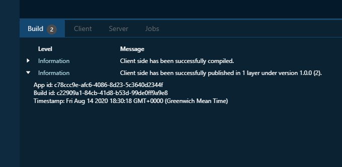

# Troubleshooting

If you have encountered any problems, please let us know by [submitting an issue](https://github.com/SpheroidUniverse/SpheroidScript/issues/new), 
we will make sure to help you find the solution. Please don't hesitate to contact us, 
as your issues and our replies will help to make our platform better and will be valuable 
to other developers.

## Register in GitHub

You need to be registered in GitHub before submitting an issue. 
If you don't have an account yet, sign up [here](https://github.com/).

## Provide an app id

In some cases, for example app malfunctioning, code not compiling, our support managers 
will ask you to provide an app id. You can also provide it before being asked if you feel 
that your issue is connected to a specific app.

If you want to find an app id, open the "Apps" tab and open the app details page 
by clicking on the preview. You will see the unique app id next to the owner name.
In some cases, you also find app id in logs that appear in the bottom pane in the "IDE" tab 
while compiling or while working on the mobile device.

## Share the access to your app

Also, our support managers may ask you to share the access to your app to our official 
support account. We understand that the app contents are your intellectual property and 
respect this, so sharing access is absolutely voluntarily. 
However, in some cases the best and fastest way 
to find a solution is for our support managers to look at your app and repeat your actions 
that cause an error. If you will be willing to share access, you will need to 
[add a new team member](team-member-add.md) to your app 
(full name: SpheroidSupport, email: support@spheroiduniverse.io). 