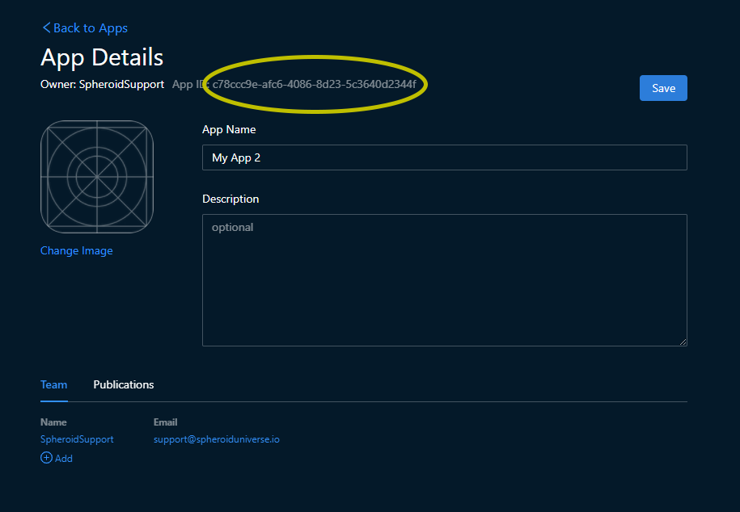
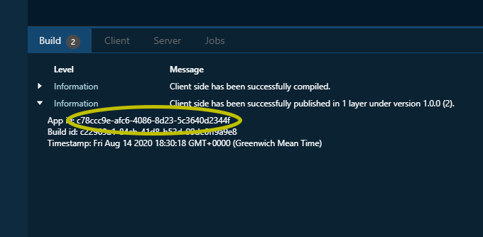

# Troubleshooting

If you have encountered any problems, please let us know by [submitting an issue](https://github.com/SpheroidUniverse/SpheroidScript/issues/new), 
we will make sure to help you find the solution. Please don't hesitate to contact us, 
as your issues and our replies will help to make our platform better and will be valuable 
to other developers.

## Register in GitHub

You need to be registered in GitHub before submitting an issue. 
If you don't have an account yet, sign up [here](https://github.com/).

## Share access and provide an app id

The best and fastest way to find a solution to your issue is to reproduce it, 
i.e. to look at your app and repeat your actions that cause an error. 
This is why we ask you to share access to your app 
to our support account and provide an app id.

[Add a team member](team-member-add.md) to your app 
(full name: SpheroidSupport, email: support@spheroiduniverse.io).

You can find app id on the app page. Open the "Apps" tab and open the app details page 
by clicking on the preview. You will see the unique app id next to the owner name.

You can also find app id in logs that appear in the bottom pane 
while compiling or while working on the mobile device.

 