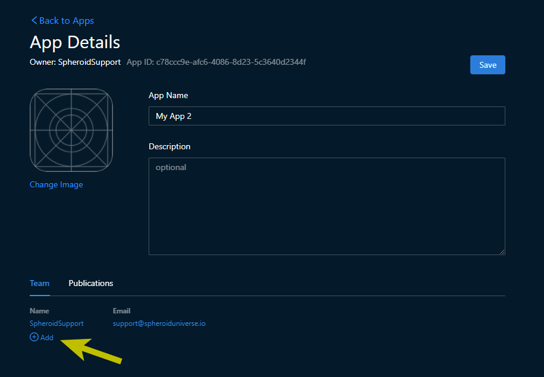
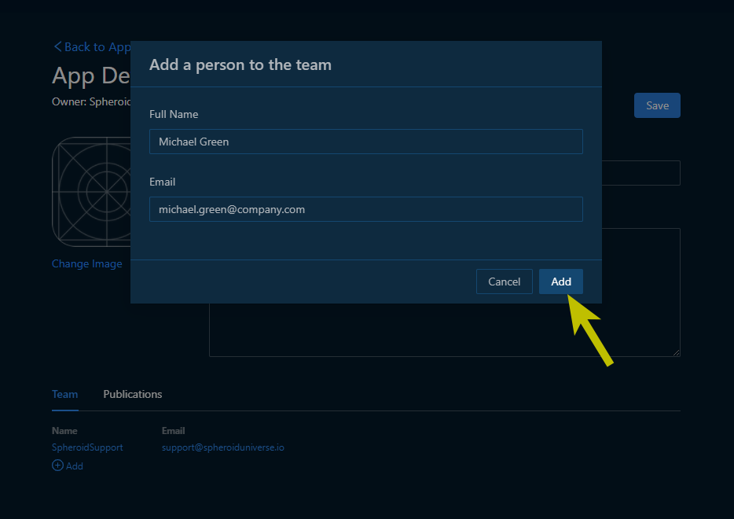

# Add a team member

From this short tutorial you will learn how to add a member to the team, in other words,
to share access to the app this team works on to someone. Note that you need to be the app owner
to do this. Also, a person you want to add to a team needs to [log in](ide-login.md) 
to the Spheroid Demiurge IDE at least once.

First, [log in](ide-login.md) to the Spheroid Demiurge IDE. Then, open the "Apps" tab 
and open the app details by clicking on the preview.

Click the "Add" button below the list of team members in the "Team" tab. If you don't see 
the "Add" button, it means you're not an owner of this app and therefore can't add a new member.

When the dialog comes up, enter an email and a full name of the new team member and then 
press "Add" and "Save".

Note that you can add several team members at once, as well as remove them. 
You also can edit other app info at the same time. 

Make all the changes and press "Save". 

You will be redirected to the apps list. 
If an error occurs, you will see a message in the top right. 
Otherwise, the changes have been applied.