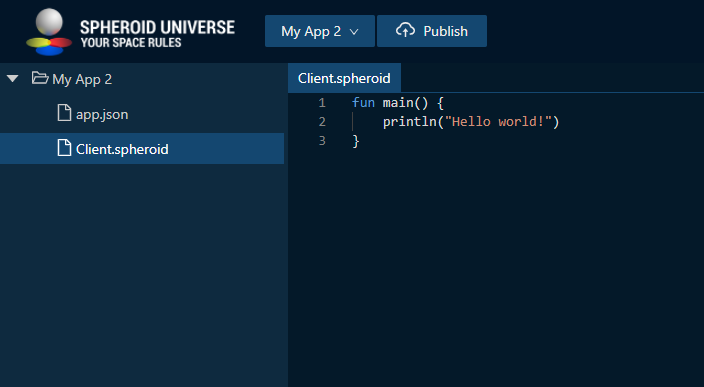

# Hello world

This tutorial will take you through the steps to create and launch on your mobile phone 
a simple app powered by the Spheroid Universe Platform. This app will 

## Create an account in the Spheroid Universe Platform

Before you create your app, you need to [create an account](https://spheroiduniverse.io/marketplace/register) in the Spheroid Universe Platform.

If you already have an account in the Spheroid Universe Platform, you can skip this step.


## Log in to the Spheroid Demiurge IDE

Now you have the access to all Platform services, including the Spheroid Demiurge IDE. 

Log in to the [Spheroid Demiurge IDE](https://demiurge.spheroiduniverse.io/ide), using the same email and password you used to register in the Platform.

## Create your app

Open the "Apps" tab and click the "Create" button. 


Enter the app name, leave the check on the "Create a layer corresponding to this app" box and click the "Create App" button. The app will be created along with the layer you will later use to publish the app into.


If the app doesn't get immediately created, and you get the error "Can't create an app because the app with the name 'xxx' already exists", it means the name you've chosen is already taken, so try another one.


## Download the source code

We have already prepared for you the source code you'll need to create a demo app. Download a zip archive from [our repo](https://github.com/SpheroidUniverse/SpheroidScript).

[TODO: image]

Then extract contents of the 'SpheroidScript-master\examples\HelloWorld\src' folder from the zip archive. You're now all set to upload the source code to your app!

## Upload the source code to Spheroid Demiurge IDE

Now, what you need to do is to upload the extracted files with source code to the IDE keeping the tree structure unchanged. So in the root of your app you need to have "app.json" and "Client.spheroid" files".

```
(Your app name)
|--- app.json
\--- Client.spheroid
```

Currently, you can't upload a whole zip or a folder to the IDE but you can upload multiple files at once by a single drag-n-drop.

Open the "IDE" tab and select your app in the dropdown list.


Left-click the root folder (with the same name as your app) to expand it and drag-n-drop the "app.json" and "Client.spheroid" files.



You're done! Now you can proceed to publishing the app.

## Publish your app

Publish your app. Click the "Publish" button in the top menu and, when the dialog comes up, keep the default settings, and click the "Publish" button at the right bottom of the dialog.


If the publication has been successful, you will see four info messages in the "Build" tab in the bottom pane. Congratulations, you have published your app!


If you don't see the four info messages, or you see error messages instead, check you've followed the previous steps accurately and, if so, [write us an issue](../../docs/issues.md), and we will help you solve the problem.

## Launch your app on your mobile phone

Now as you have your app built and published, it's time to run it on your mobile phone.

Download the XRHub Android mobile app either by [following the Google Play link](https://play.google.com/store/apps/details?id=io.spheroid.spheroidandroid) or by scanning the QR code:


|  |  |  |  |
| --- | --- | --- | --- |
|  |  |  |  |

Currently, XRHub works on the Android devices that [support ARCore](https://developers.google.com/ar/discover/supported-devices) only. iOS version of the app will be released soon.

Launch the XRHub app on your phone.


|  |  |  |  |
| --- | --- | --- | --- |
|  |  |  |  |

Tap the menu button in the bottom center, then tap the account icon and log in to the app using the same email and password you used to register in the Platform.

|  |  |  | 
| --- | --- | --- | --- |
|  |  |  |  |

When you're authorized, swipe right through the list of worlds to find the world your app has been published into (world is called "layer" in IDE). Note that if you're not logged in, you won't see the world, because the worlds created by developers are private. In the later tutorials you will learn how to add testers to your layer aka world.

|  |  |  |  |
| --- | --- | --- | --- |
|  |  |  |  |

When you've found your world, tap the "Launch" button, and your app will run. 
Congratulations, you have successfully run your app in the XRHub! 
See the "Hello world!" log in the "Client" tab in the bottom pane.

## Troubleshooting

If you have encountered any problems, please let us know by [submitting an issue](../../docs/issues.md), we will make sure to help you find the solution. Please don't hesitate to contact us, as your issues and our replies will help to make our platform better and will be valuable to other developers.

## What next?

In the next tutorials, we will take a closer look at what we've done by exploring the source code of the app.
We'll get familiar with the Spheroid Script – the Platform language.
We'll talk about the project structure and discuss some key concepts e.g. dividing code into a client-side part, and a server-side part.
Finally, we'll learn the basics of persisting data in a cloud database using the Spheroid SQL.

Until the next tutorial, you can already start exploring Spheroid Script by yourself using the [documentation](https://spheroiduniverse.github.io/SpheroidScript/).